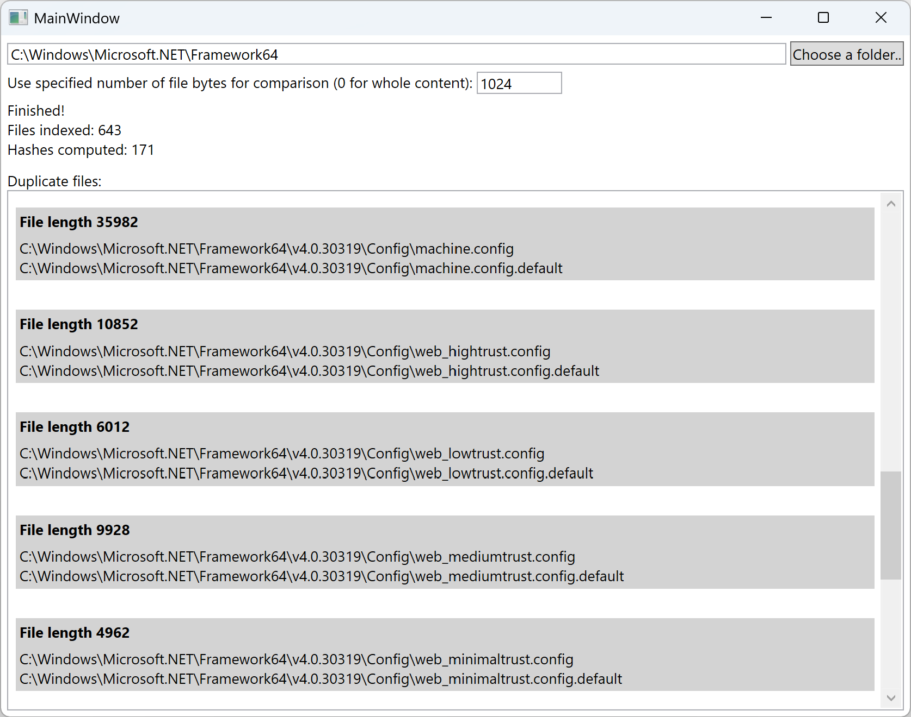

# Test task: Find File Duplicates (2015)
The task here was to create an application which implements duplicate files search with relaxed precision. More concretely, file sizes and hashes should be used to check for file equivalence, and the hashes should be computed only for fixed-size part of each file (e.g. first 1024 bytes). The hashable size should be configurable by the user. The idea here was that most user files (e.g. photos), if not duplicates, would likely differ in many locations within file, so checking just the beginning should be enough. And files which differ by appended content would have different size. (Alternatively, this could be used as a first-level check, followed by exact comparison for found duplicate candidates)
The hashes are computed lazily, so that if files can be distinguished by size, hash computation is eliminated. The effect of that is visible from some statistics the application shows.

Without being production-quality application, running it for different locations on my machine always surprises me how many duplicates I have!

